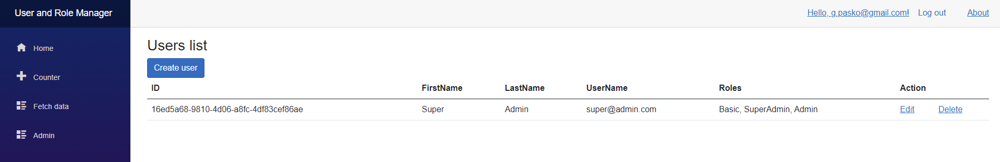
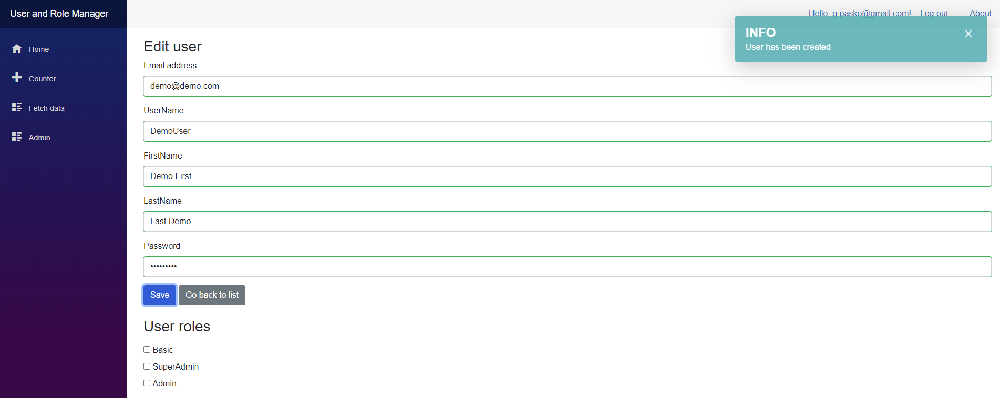
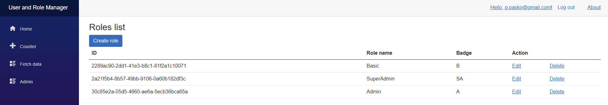

# BlazorServerUserRoleManager

## Description
Implementation for user and roles management into Blazor Server application based on ASP.Net Core Identity.

Project include customization for default User and Role Identity:
* First and last name for user
* Badge field for role

## Built With

Project is created with:
* [Blazored.Toast](https://github.com/Blazored/Toast)
* [FluentValidation](https://github.com/Blazored/FluentValidation)

## Usage

Set connection string in `appsettings.json` and update database

## License
Distributed under the MIT License. See `LICENSE.txt` for more information.

## Useful links

* [ASP.NET Core Blazor authentication and authorization](https://docs.microsoft.com/en-us/aspnet/core/blazor/security/?view=aspnetcore-6.0)
